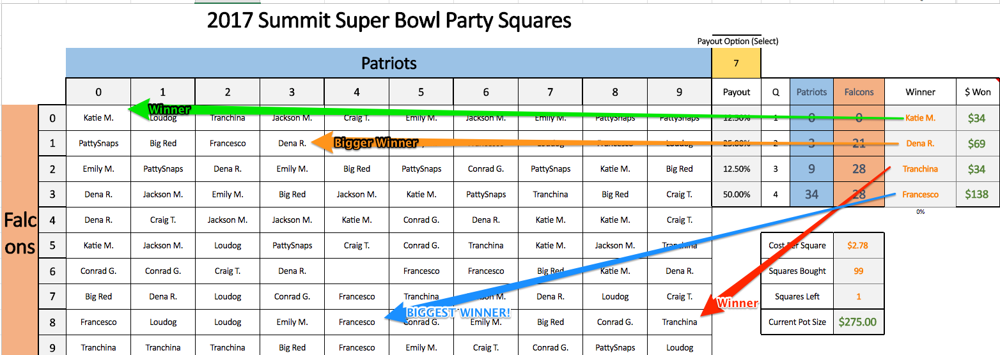

# Super Bowl Squares Smart Contract Project
* 

## Project Overview
 Create Ethereum-powered smart contract that would decentralize and automate a game of "Super Bowl Squares". Users would send Eth to the contract, claiming a proportion of the available squares equal to the proportion of their contribution.

### Contract Logic and Back-end Components
1. determine squares awarded to each player proportional to amount sent to contract
1. randomly assign grid at kickoff
1. use oracle to pull off-blockchain data including game score to use in smart contract logic and determine winners
1. pay Eth back to address of origin at end of 1st, 2nd, 3rd and 4th quarters

### UI and Front-end Components
1. user would interact with the contract accessing front end webpage from  browser with metamask
1. page will display grid, list of players and proportions, payout proportions
1. button to join the game would ask user for amount to send and name for the square
2. test

### Potential Issues/Concerns:
* worry about rounding down
* spamming the contract

### Advanced
* make open source/modular to any football game

### More Resources
* [Super Bowl Squares Rules](http://keithlam.com/2006/02/07/football-squares-pool/)

